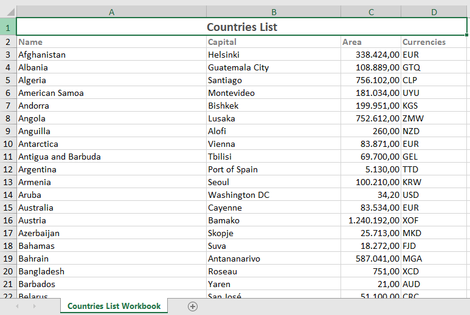

# countries-list
This project was created to consume an API from REST Countries and return its data as a .xlsx document.

## Installation

```bash
 Clone this repository
 $ git clone https://github.com/anderson-rodriguesdev/countries-list.git

 Install dependencies
 $ npm install

 Run
 $ node index.js
```

# Demo
